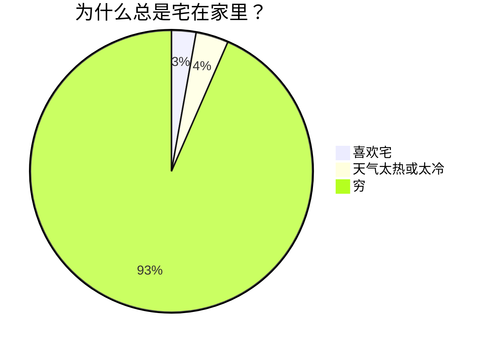
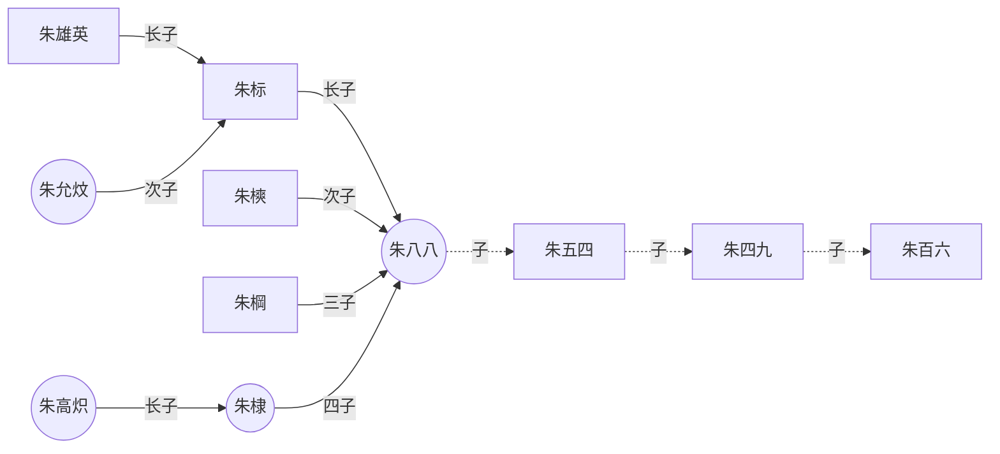
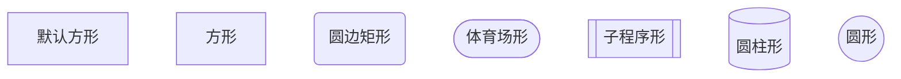
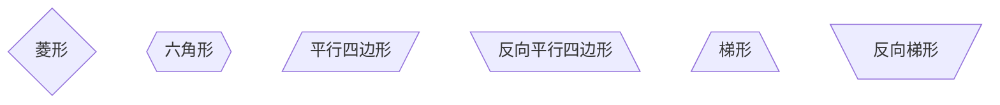
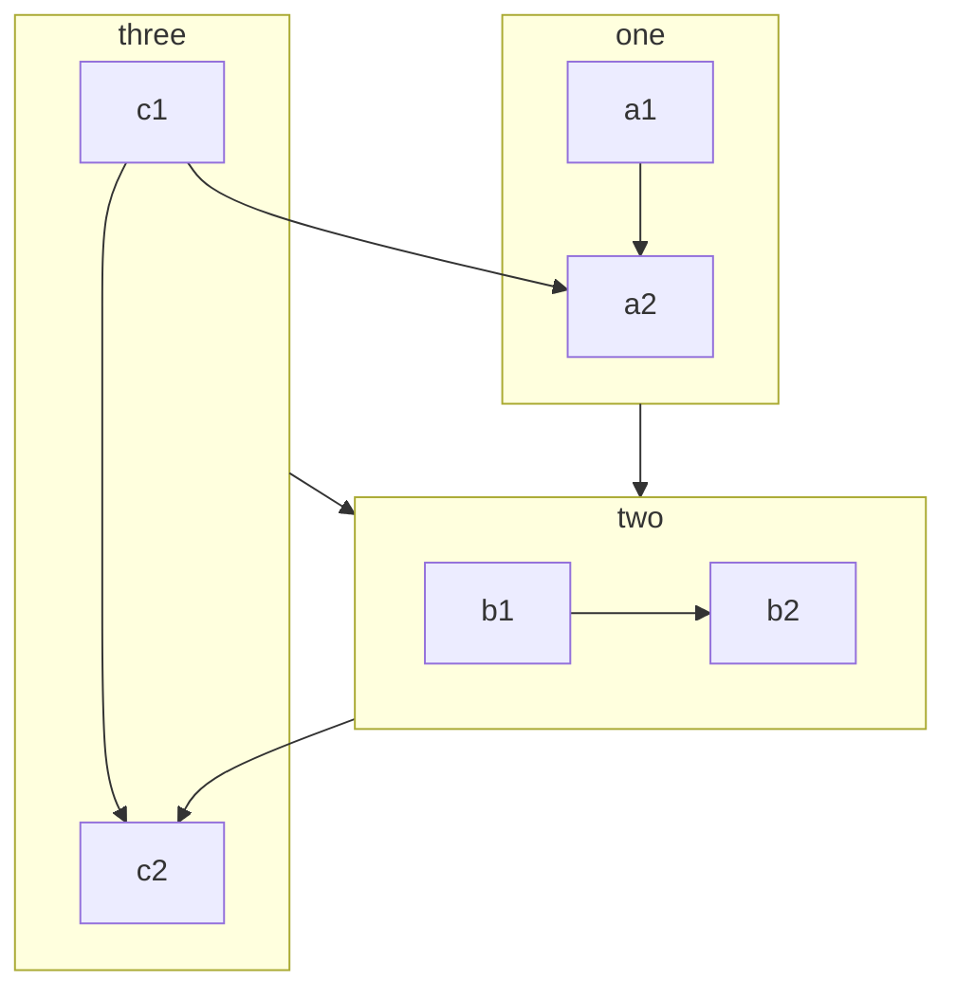
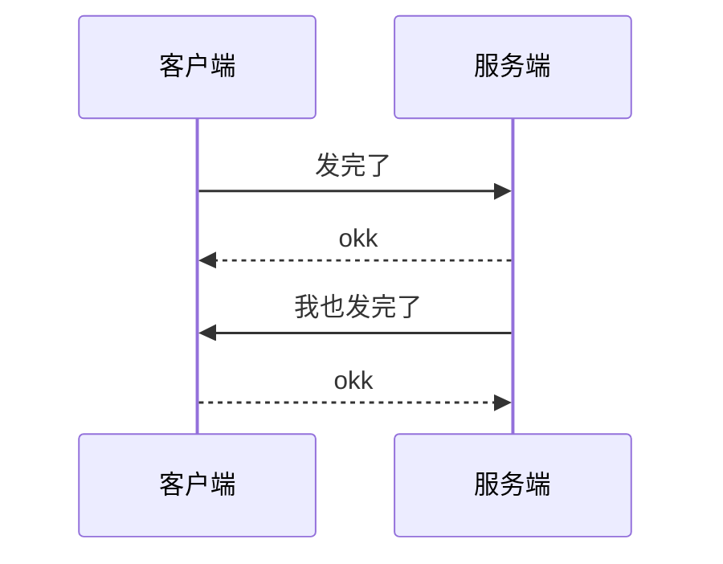

# 饼状图

```mermaid
pie
    title 为什么总是宅在家里？
    "喜欢宅" : 15
    "天气太热或太冷" : 20
    "穷" : 500
    
```
# 流程图

```mermaid
graph LR
emperor((朱八八))-.子.->朱五四-.子.->朱四九-.子.->朱百六
朱雄英--长子-->朱标--长子-->emperor
emperor2((朱允炆))--次子-->朱标
朱樉--次子-->emperor
朱棡--三子-->emperor
emperor3((朱棣))--四子-->emperor
emperor4((朱高炽))--长子-->emperor3
    
```
# 不同形状1

```mermaid
graph TD
    默认方形
    id1[方形]
    id2(圆边矩形)
    id3([体育场形])
    id4[[子程序形]]
    id5[(圆柱形)]
    id6((圆形))
```

# 不同形状2

```mermaid
graph TD
id1{菱形}
	id2{{六角形}}
	id3[/平行四边形/]
	id4[\反向平行四边形\]
	id5[/梯形\]
	id6[\反向梯形/]
```

# 子图

```mermaid
flowchart TB
    c1-->a2
    subgraph one
    a1-->a2
    end
    subgraph two
    b1-->b2
    end
    subgraph three
    c1-->c2
    end
    one --> two
    three --> two
    two --> c2
```

# sequenceDiagram

```mermaid
sequenceDiagram
    客户端->>服务端 : 发完了
    服务端-->>客户端 : okk
    服务端->>客户端 : 我也发完了
    客户端-->>服务端 : okk
```