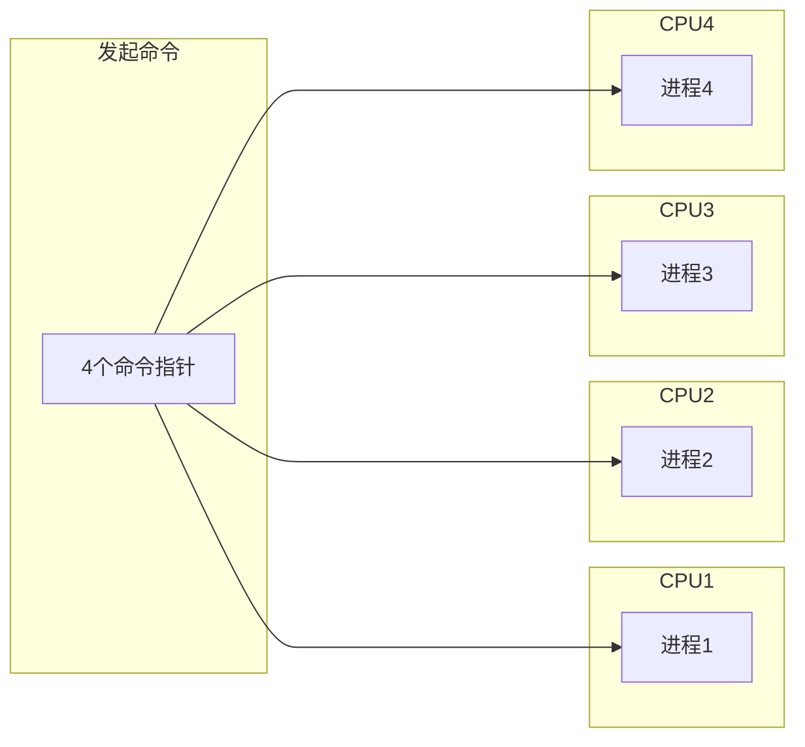
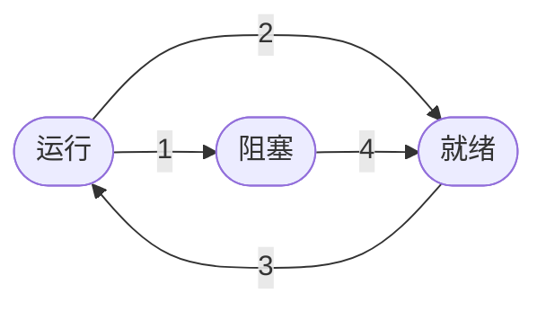
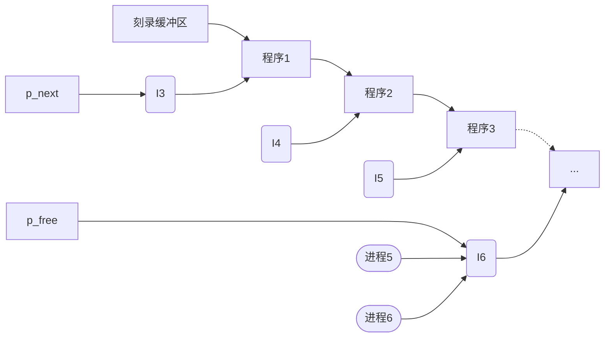
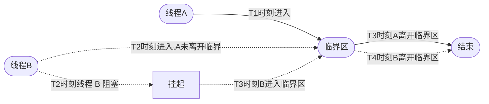

# **c++多线程实战**

- [**c++多线程实战**](#c多线程实战)
- [第1章 面试问题汇总](#第1章-面试问题汇总)
  - [线程相关函数](#线程相关函数)
  - [线程同步](#线程同步)
  - [死锁](#死锁)
    - [如何避免死锁](#如何避免死锁)
  - [读写锁](#读写锁)
    - [读写锁相关操作](#读写锁相关操作)
  - [条件变量](#条件变量)
  - [信号量](#信号量)
    - [信号量函数](#信号量函数)
  - [线程池](#线程池)
    - [线程池原理](#线程池原理)
- [第2章 进程和线程的概念](#第2章-进程和线程的概念)
  - [简介](#简介)
  - [进程和线程](#进程和线程)
    - [内存分配](#内存分配)
  - [解释进程模型](#解释进程模型)
  - [进程的实现](#进程的实现)
  - [进程间通信（IPC）](#进程间通信ipc)
  - [解决典型的 IPC 问题](#解决典型的-ipc-问题)
    - [哲学家就餐问题](#哲学家就餐问题)
  - [线程模型的实现](#线程模型的实现)
  - [线程的用法](#线程的用法)
  - [在用户空间实现线程](#在用户空间实现线程)
  - [在内核实现线程](#在内核实现线程)

# 第1章 面试问题汇总
**/////////////////////////////////////////////**

## 线程相关函数
>**线程的创建：** 每个线程都有唯一的线程 ID，类型为 pthread_t，是一个无符号长整型数。
```cpp
#include <iostream>
#include <pthread>
#include <unistd.h>

using namespace std;

void* func(){
//返回当前线程的线程 ID
//pthread_t pthread_self(void);
    cout << "子线程" << pthread_self() << endl;
    return nullptr;
}
int main(){
//创建一个线程，func 为线程操作函数名
    pthread_t tid;
    pthread_create(&tid, nullptr, func, nullptr);
}
```

>**线程退出函数：** 如果想让线程退出但是不会导致虚拟地址空间的释放（针对主线程），我们可以调用线程库中的线程退出函数，<font color = red>只要跳用该函数当前线程就马上退出，并且不会影响到其他线程的正常运行，在子线程和主线程中都可以使用。</font>
```cpp
int main(){
    pthread_t tid;
    pthread_create(&tid, nullptr, func, nullptr);
    cout << "主线程" << pthread_self() << endl;
    pthread_exit(nullptr);
}
```

>**线程回收：** 线程和进程一样，子线程退出的时候其内核资源主要由主线程回收，线程库中提供的线程回收函数叫做 <font color = red> pthread_join() </font> ，这个函数是一个阻塞函数，如果还有子线程在运行，调用该函数就会阻塞，子线程退出函数接触阻塞进行资源回收，函数被调用一次，只能回收一个子线程，如果多个子线程则需要循环回收。
```cpp
struct Test
{
    int num;
    int age;
};
void *func(void *arg)
{
    for (int i = 0; i < 5; i++)
    {
        cout << "子线程: " << pthread_self() << endl;
    }
    Test *t = (Test *)arg;
    t->age = 20;
    t->num = 18;

    pthread_exit(&t);

    return nullptr;
}
int main()
{
    Test t;
    pthread_t tid;
    pthread_create(&tid, nullptr, func, &t);
    //pthread_exit(tid);
    for (int i = 0; i < 5; i++)
    {
        cout << "主线程: " << pthread_self() << endl;
        //sleep(1);
    }
    void *ptr;
    pthread_join(tid, &ptr);
    //Test *pt = (Test *)ptr;
    cout << t.num << ", " << t.age << endl;
}
```

>**线程分离：** 若不分离，主线程调用 pthread_join()时，会阻塞，其他线程会停止执行。
调用 pthread_detach()后，子线程和主线程分离，当子线程退出的时候，其占用的内核资源就被系统的其他进程接管并回收了，线程分离之后在主线程中使用 pthread_join()就回收不到子线程资源。
```cpp

```

## 线程同步
>多个线程按照先后顺序依次执行

```cpp
/**
 * @brief 互斥锁
 * 
 */
#define THREAD_NUL 10
pthread_mutex_t mutexlock;

void *thread_proc(void *arg)
{

    int *pcount = (int *)arg;
    int i = 0;
    while (i++ < 100000)
    {
        pthread_mutex_lock(&mutexlock);
        (*pcount)++;
        pthread_mutex_unlock(&mutexlock);
        usleep(100);
    }
    return 0;
}

int main()
{
    int i = 0;
    pthread_t __thread_id[THREAD_NUM] = {0};
    int count = 0;

    pthread_mutex_init(&mutexlock, nullptr);

    for (i = 0; i < THREAD_NUM; i++)
    {
        pthread_create(&__thread_id[i], NULL, thread_proc, &count);
    }

    for (i = 0; i < 10; i++)
    {
        //cout << "i = " << i << endl;
        cout << "count = " << count << endl;
        sleep(1);
    }

    return 0;
}
```
## 死锁
>多个线程访问共享资源，需要加锁，如果加锁不当，就会造成死锁。所有线程都被阻塞，并且无法解开（因为可以解锁的线程也被阻塞）
```cpp
/**
 * @brief 没有解锁
 * 
 */
#include <iostream>
#include <pthread.h>
#include <thread>
#include <unistd.h>

using namespace std;

pthread_mutex_t mutexlock;
void *test01(void *arg)
{
    for (size_t i = 0; i < 10; i++)
    {
        pthread_mutex_lock(&mutexlock);
        cout << "test01" << endl;
        //没有解锁,导致只有一次输出
        //pthread_mutex_unlock(&mutexlock);
    }
    return nullptr;
}

int main(int argc, char const *argv[])
{
    pthread_mutex_init(&mutexlock, nullptr);
    pthread_t tid;
    pthread_create(&tid, nullptr, test01, nullptr);
    sleep(1);
    return 0;
}
```
```cpp

/**
 * @brief 重复加锁导致死锁
 * 
 */
void *test02(void *arg)
{
    for (size_t i = 0; i < 10; i++)
    {
        //重复加锁,直接没有输出
        //通常两个加锁函数互相调用导致
        pthread_mutex_lock(&mutexlock);
        pthread_mutex_lock(&mutexlock);

        cout << "test02" << endl;
        pthread_mutex_unlock(&mutexlock);
    }
    return nullptr;
}

int main(int argc, char const *argv[])
{
    pthread_mutex_init(&mutexlock, nullptr);
    pthread_t tid;
    pthread_create(&tid, nullptr, test02, nullptr);
    sleep(1);
    return 0;
}
```
```cpp
/**
 * @brief 两个共享资源被两个线程加锁，导致互相拿不到另一个资源
 * 
 * @param arg 
 * @return void* 
 */
void *test03(void *arg)
{
    for (size_t i = 0; i < 100; i++)
    {
        pthread_mutex_lock(&mutexlock);
        /**
        次线程拿到第一个资源后上锁
        usleep(1)必然导致下一个资源被另一个线程拿到
        因此另一把锁会被另一个线程锁定最终导致死锁
        **/
        usleep(1);
        pthread_mutex_lock(&mutexlock1);
        cout << "test03: " << i << endl;
        pthread_mutex_unlock(&mutexlock1);
        pthread_mutex_unlock(&mutexlock);
    }
    return nullptr;
}
void *test03_1(void *arg)
{
    for (size_t i = 0; i < 100; i++)
    {
        pthread_mutex_lock(&mutexlock1);
        usleep(1);
        pthread_mutex_lock(&mutexlock);
        cout << "test03_1: " << i << endl;
        pthread_mutex_unlock(&mutexlock);
        pthread_mutex_unlock(&mutexlock1);
    }
    return nullptr;
}

int main(int argc, char const *argv[])
{
    pthread_mutex_init(&mutexlock, nullptr);
    pthread_t tid;
    pthread_t tid1;
    pthread_create(&tid, nullptr, test03, nullptr);
    pthread_create(&tid1, nullptr, test03_1, nullptr);
    sleep(10);
    return 0;
}
```
### 如何避免死锁
><font color = red>
1，避免多次锁的，多检查
2，对共享资源访问完毕之后，一定要解锁，或者加锁前使用 try_lock()
3，如果有多把锁，可以控制锁的访问顺序，顺序访问共享资源，但在有些情况下做不到，另外也可以在对其他互斥锁加锁之前，释放掉当前拥有的互斥锁。
4，项目程序中引入专门用于死锁检测的模块
</font>

## 读写锁
>读写锁是互斥锁的升级版，在做读操作的时候可以提高程序的执行效率，如果所有的线程都是做读操作，那么读是并行的，但是使用互斥锁，读操作也是串型的。
读写锁类行为 pthread_rwlock_t，

```cpp
//读写锁创建方式
    pthread_rwlock_t twlock;
```
><font color = red> 写是独占的，写的优先级比读高 </font>

### 读写锁相关操作
```cpp
#include <iostream>
#include <pthread.h>
#include <unistd.h>
#include <string>

using namespace std;

#define READLOCK_NUM 5
#define WRITELOCK_NUM 5
#define READTIME 5
#define WRITETIME 50

//全局变量，读写锁需要操作的部分(共享资源)
int num = 0;

pthread_rwlock_t rwlock = PTHREAD_RWLOCK_INITIALIZER;

//读操作函数
void *read(void *arg)
{
    for (size_t i = 0; i < READTIME; i++)
    {
        //读锁
        pthread_rwlock_rdlock(&rwlock);
        printf("read, id = %d, number = %d\n", this_thread::get_id(), num);
        pthread_rwlock_unlock(&rwlock);
    }
    return nullptr;
}
//写操作函数
void *write(void *arg)
{
    for (size_t i = 0; i < WRITETIME; i++)
    {
        //写锁
        pthread_rwlock_wrlock(&rwlock);
        printf("write, id = %d, number = %d\n", pthread_self(), ++num);
        pthread_rwlock_unlock(&rwlock);
    }
    return nullptr;
}
int main(int argc, char const *argv[])
{
    //创建五个读线程和五个写线程
    pthread_t th1[READLOCK_NUM], th2[WRITELOCK_NUM];

    //创建线程
    for (size_t i = 0; i < READLOCK_NUM; i++)
    {
        pthread_create(&th1[i], nullptr, read, nullptr);
    }
    for (size_t i = 0; i < WRITELOCK_NUM; i++)
    {
        pthread_create(&th1[i], nullptr, write, nullptr);
    }
    sleep(10);
    
    //回收线程
    for (size_t i = 0; i < READLOCK_NUM; i++)
    {
        pthread_join(th1[i], nullptr);
    }
    for (size_t i = 0; i < WRITELOCK_NUM; i++)
    {
        pthread_join(th2[i], nullptr);
    }

    //读写锁销毁
    pthread_rwlock_destroy(&rwlock);
    return 0;
}
```

## 条件变量
>条件变量的主要作用不是处理线程同步，而是进行线程的阻塞。如果在多线程程序中只使用条件变量无法实现线程的同步，必须要配合互斥锁来使用。虽然条件变量和互斥锁都能进行线程阻塞，但是二者的效果是不一样的，条件变量只有在满足条件下才会阻塞线程，多个线程可以同时进入临界区。

><font color = red> 一般在生产者消费者模式中使用条件变量 </font>

```cpp
#include <iostream>
#include <pthread.h>
#include <unistd.h>

using namespace std;

//生产者消费者数量
#define PRODUCER 5
#define CONSUMER 5
#define MAX_ITEM 50

//条件变量与互斥锁
pthread_mutex_t mutex1 = PTHREAD_MUTEX_INITIALIZER;
pthread_cond_t cond1 = PTHREAD_COND_INITIALIZER;
pthread_cond_t cond2 = PTHREAD_COND_INITIALIZER;

struct Node
{
    int num;
    struct Node *next;
    Node() {}
    Node(int num) : num(num), next(nullptr) {}
    Node(int num, Node* next) : num(num), next(next) {}
};
Node *head = nullptr;

//获取当前仓库内物品数量
int getItemNum(Node *head){
    Node *myhead = head;
    int num = 0;
    while(myhead){
        num++;
        myhead = myhead->next;
    }
    return num;
}
//生产函数
void *producer(void *arg)
{
    //生产者一直想要生产，卷王就是你
    while(1){
        //进来把锁锁上
        pthread_mutex_lock(&mutex1);

        //如果仓库满了，那我没法生产了
        while(getItemNum(head) >= MAX_ITEM){
            cout << "仓库都满啦！！" << endl;
            sleep(1);
            /*
                休息一下，把条件变量存储起来 cond2 存储发起的请求线程的信息
                mutex 此时打开，等到谁给 cond2 发起通知时，自动加锁（还是要抢）继续生产
            */
            pthread_cond_wait(&cond2, &mutex1);
        }

        //生产过程
        Node *item = new Node(rand() % 100);
        item->next = head;
        head = item;
        printf("生产者，id：%ld，number：%d, total = %d\n", pthread_self(), item->num, getItemNum(head));
        
        //解锁
        pthread_mutex_unlock(&mutex1);
        //向消费者发送信息
        pthread_cond_broadcast(&cond1);
        sleep(rand()%3);
    }
    return nullptr;
}
//消费函数
void *consumer(void *arg)
{
    //贪得无厌，一直消费
    while(1){
        //进来先把门锁上
        pthread_mutex_lock(&mutex1);

        //当仓库没有东西，没法消费
        while(getItemNum(head) < 1){
            cout << "仓库都空啦！！" << endl;
            //等，cond1 存储等的人的信息
            pthread_cond_wait(&cond1, &mutex1);
        }
        Node *item = head;
        head = head->next;
        printf("消费者，id：%ld，number：%d, total = %d\n", pthread_self(), item->num, getItemNum(head));
        delete item;

        pthread_mutex_unlock(&mutex1);
        //给生产者发送信息
        pthread_cond_broadcast(&cond2);
        sleep(rand()%3);
    }
    return nullptr;
}

int main()
{
    srand(time(nullptr));
    //创建线程
    pthread_t th1[PRODUCER], th2[CONSUMER];
    for (size_t i = 0; i < PRODUCER; i++)
    {
        pthread_create(&th1[i], nullptr, producer, nullptr);
    }
    for (size_t i = 0; i < CONSUMER; i++)
    {
        pthread_create(&th2[i], nullptr, consumer, nullptr);
    }
    //回收线程
    for (size_t i = 0; i < PRODUCER; i++)
    {
        pthread_join(th1[i], nullptr);
    }
    for (size_t i = 0; i < CONSUMER; i++)
    {
        pthread_join(th2[i], nullptr);
    }
    //删除锁和条件变量
    pthread_mutex_destroy(&mutex1);
    pthread_cond_destroy(&cond1);
}
```

## 信号量

### 信号量函数

>信号量用于多线程多任务同步，一个线程完成了某一个动作就通过信号量告诉别的线程，别的线程再进行某些动作。信号量不一定是锁定某个资源，而是流程上的概念，比如：有 A，B 两个线程，B 线程要等 A 线程完成某一项任务后再进行自己下面的步骤，这个任务并不一定是锁定某一资源，还可以是进行一些计算或者数据处理之类。

>**信号量（信号灯🚥）：** 与互斥锁和条件变量的主要不同在于“灯”的概念，灯亮则意味着资源可用，灯灭则意味着不可用。信号量主要阻塞线程，不能完全保证线程安全，如果要保证线程安全需要信号量和互斥锁一起使用。

>信号量和条件变量一样用于生产者消费者模型，用于阻塞生产者线程或者消费者线程的运行。信号的类型为 <font color = red> sem_t </font> 对应的头文件为 <font color = red> <semaphore.h>。 </font>

```cpp
#include <iostream>
#include <semaphore.h>
#include <pthread.h>
#include <unistd.h>

/**
 * @brief 
 * mac OS X 不支持sem_init()和sem_destroy()
解决办法:

sem_init(&sem, 0, 1)改成
sem_open("sem", O_CREAT|O_EXCL, S_IRWXU, 0)

sem_destory(&sem)改成
sem_unlink("sem");
另外，支持pthread_mutex_init(&mutex, NULL)
却不支持pthread_mutex_destory(&mutex)
 * 
 */
using namespace std;

sem_t *sem1, *sem2;
pthread_mutex_t mutex1 = PTHREAD_MUTEX_INITIALIZER;

//生产者消费者数量
#define PRODUCER 5
#define CONSUMER 5
#define MAX_ITEM 50

struct Node
{
    int num;
    struct Node *next;
    Node() {}
    Node(int num) : num(num), next(nullptr) {}
    Node(int num, Node *next) : num(num), next(next) {}
};
Node *head = nullptr;

//获取当前仓库内物品数量
int getItemNum(Node *head)
{
    Node *myhead = head;
    int num = 0;
    while (myhead)
    {
        num++;
        myhead = myhead->next;
    }
    return num;
}

//生产函数
void *producer(void *arg)
{
    while (1)
    {
        sem_wait(sem1);
        pthread_mutex_lock(&mutex1);
        Node *item = new Node(rand() % 100);
        item->next = head;
        head = item;
        printf("生产者，id：%ld，number：%d, total = %d\n", pthread_self(), item->num, getItemNum(head));
        sem_post(sem2);
        pthread_mutex_unlock(&mutex1);
        sleep(rand() % 3);
    }
    return nullptr;
}
//消费函数
void *consumer(void *arg)
{
    while (1)
    {
        sem_wait(sem2);
        pthread_mutex_lock(&mutex1);
        Node *item = head;
        if (head)
        {
            head = head->next;
            printf("消费者，id：%ld，number：%d, total = %d\n", pthread_self(), item->num, getItemNum(head));
        }
        else
        {
            printf("消费者，id：%ld，number：%d, total = %d\n", pthread_self(), -1, getItemNum(head));
        }
        delete (item);
        pthread_mutex_unlock(&mutex1);
        sem_post(sem1);
        sleep(rand() % 3);
    }
    return nullptr;
}

int main()
{
    /*
        sem_t *sem_open(const char *name, int oflag, mode_t mode, unsinged int value);
        name --> 信号灯的外部名字
        oflag --> 选择创建或打开一个现有的信号灯
        mode --> 权限位
        value --> 信号灯初始值

        oflag参数可以是：
            1，0
            2，O_CREAT 创建一个信号灯
            3，O_CREAT｜O_EXCL 如果没有指定的信号灯就创建
    */
    //sem1 = sem_open("sem1", O_CREAT | O_EXCL, S_IRWXU, 10);
    //sem2 = sem_open("sem2", O_CREAT | O_EXCL, S_IRWXU, 0);

    sem_init(sem1, 0, 5);
    sem_init(sem2, 0, 5);

    srand(time(nullptr));
    //创建线程
    pthread_t th1[PRODUCER], th2[CONSUMER];
    for (size_t i = 0; i < PRODUCER; i++)
    {
        pthread_create(&th1[i], nullptr, producer, nullptr);
    }
    for (size_t i = 0; i < CONSUMER; i++)
    {
        pthread_create(&th2[i], nullptr, consumer, nullptr);
    }
    //回收线程
    for (size_t i = 0; i < PRODUCER; i++)
    {
        pthread_join(th1[i], nullptr);
    }
    for (size_t i = 0; i < CONSUMER; i++)
    {
        pthread_join(th2[i], nullptr);
    }

    pthread_mutex_destroy(&mutex1);
    sem_destroy(sem1);
    sem_destroy(sem2);
}

```
## 线程池
### 线程池原理

>我们使用线程的时候就去创建一个线程，这样实现起来非常方便，但是有一个问题：如果并发的线程数量很多，并且每个线程都是执行一个时间很短的任务就结束了，这样频繁创建线程就会大大降低系统效率，因为频繁创建线程和销毁线程需要时间。
<font color = darkcyan> 线程池是一种多线程处理形式，处理过程中将任务添加到队列，然后在创建线程后自动启动这些任务。线程池线程都是后台线程。每个线程都使用默认的堆栈大小，以默认的优先级运行，并处于多线程单元中。如果某个线程在托管代码中空闲（如正在等待某个事件），则线程池将插入另一个辅助线程来使所有处理器保持繁忙。如果所有线程池线程都始终繁忙，但队列中包含挂起的工作，则线程池将在一段时间后创建另一个辅助线程但线程数目永远不会超过最大值。超过最大值的线程可以排队，但他们要等到其他线程完成后才启动。</font>

>**线程池工作原理：** 线程池组成主要分为三部分
1，**任务队列**，存储需要处理的任务，有工作的线程来处理这些任务。
<font color = red>$\bullet$ 通过线程池提供的 API 函数，将一个待处理的任务添加到任务队列，或者从任务队列中删除。
$\bullet$ 已处理的任务会被从任务队列中删除。
$\bullet$ 线程池的使用者，也就是调用线程池函数往任务队列中添加任务的线程就是生产者线程。</font>

>2，**工作的线程（任务队列任务的消费者）**，N 个<font color = red>
$\bullet$ 线程池中维护了一定数量的工作线程，它们的作用是不停地读任务队列，从里面取出任务并处理。
$\bullet$ 工作的线程相当于是任务队列的消费者角色。
$\bullet$ 如果任务队列为空，工作的线程将会被阻塞（使用条件变量/信号量阻塞）。
$\bullet$ 如果阻塞之后有了新的任务，由生产者将阻塞解除，工作线程开始工作。</font>

>3，**管理者线程（不处理任务队列中的任务）**，1 个<font color = red>
$\bullet$ 它的任务是周期性地对任务队列中的任务数量以及处于忙状态的工作线程个数进行检测。
$\bullet$ 当任务过多，可以适当创建新的工作线程。
$\bullet$ 当任务过少，可以适当销毁一些工作线程。</font>


# 第2章 进程和线程的概念
**/////////////////////////////////////////////**

## 简介

><font color=red> 严格意义上来说，CPU 在任何时刻只运行一个进程，只不过他快速切换进程营造了并行处理的假象

>近些年来，操作系统演变为一个顺序的概念模型（顺序进程）。包括操作系统在内，所有的可运行软件都在计算机中表现为一系列顺序进程。进程是执行程序的实例。每个进程都有自己的虚拟地址空间和控制线程。线程是操作系统调度器（scheduler）分配处理器时间的基础单元。我们可以把系统看作是运行在并行环境中的进程集合。在进程（程序）间快速地反复切换叫做多任务处理</font>

## 进程和线程

### 内存分配

>**线程共享的环境包括：** 进程代码段，进程的公有数据（利用这些共享的数据，线程很容易实现相互之间的通信），进程打开的文件描述符，信号的处理器，进程的当前目录和进程用户 ID 与进程组 ID
>**每个线程的私有资源：** <font color = darkcyan>
>1，线程 ID
2，寄存器组的值
3，线程的栈
4，错误返回码 errno 的值
5，线程的信号屏蔽码
6，线程的优先级
**线程实现方式：**
1，LWP（轻量级进程）作为多线程方案
2，纯用户空间多线程方案
3，混合版多线程方案
</font>

><font color = red>线程不是无限制创建的，线程切换消耗 CPU 资源；线程创建和销毁也是销毁 CPU 资源；线程池线程数量一般为 2*CPU数量
</font>

**单核处理器：**


**多核处理器：**



>在传统操作系统中，每个进程都有一个地址空间和一个控制线程。在许多情况下，一个进程的地址空间中要执行多个线程，在标准并行上下文中，这些线程就像是不同的进程一样。有多个线程的主要原因是，许多应用程序都要求能立即执行多项操作。

>当然，某些操作可以等待（阻塞）一段时间。把运行在准并行上下文中的应用程序分解成多个单独的线程，程序设计模型就变得更简单了。通过添加线程，操作系统提供了一个新特性；并行实体能共享一个地址空间和它们的所有数据。这是执行并发的必要条件。

## 解释进程模型

>传统操作系统必须提供创建进程和终止进程的方法。下面列出了4个引发创建进程的主要事件：

><font color = darkcyan>1，系统初始化
2，正在运行的进程执行创建进程的系统调用
3，用户要求创建新进程
4，启动批处理作业
</font>

>操作系统启动后，会创建多个进程。一些是 <font color = darkcyan>前台进程</font>，与用户交互，并根据用户的要求执行操作。还有一些是<font color = darkcyan> 后台进程</font>，执行特定的功能，与用户行为不相关。例如，可以吧接受电子邮件设计成后台进程，因为大部分时间都用不到这一功能，只需在有电子邮件到达时处理即可。后台进程通常处理诸如电子邮件，打印等活动.

>在 Windows 中，CreateProcess（一个 Win32 函数调用）负责创建进程和加载进程上下文。

```cpp
#include <iostream>
#include <Windows.h>
#include <tchar.h>

using namespace std;

int _tmain(int argc, _TCHAR* argv[]){
  STARTUPINFO startupInfo = { 0 };
  PROCESS_INFORMATION processInformation = { 0 };

/*
  CreateProcess 函数用于创建一个新进程及主线程。
  新进程在主调进程的安全上下文中运行。
*/
  BOOL bSuccess = CreateProcess(
    TEXT("C:\\Windows\\notepad.exe"), NULL, NULL,
    NULL, FALSE, NULL, NULL, NULL, &startupInfo,
    &processInformation);

  if(bSuccess){
    cout << " Process started." << endl
         << " Process ID:\t"
         << processInformation.dwProcessId << endl;
  }
  else{
    cout << " Cannot start process!" << endl
         << " Error code:\t" << GetLastError() << endl;
  }
  return system("pause");
}
```

>操作系统为进程分配进程标识符。进程标识符用于标识进程，在进程终止之前有效果。或者，对于一些 [API](https://www.redhat.com/zh/topics/api/what-are-application-programming-interfaces)（如 [OpenProcess](https://baike.baidu.com/item/OpenProcess) 函数），进程标识符用于获得进程的句柄。最初线程的线程标识符由进程分配，该标识符可用于在 [OpenThread](https://baike.baidu.com/item/openthread/10272572) 中打开一个线程句柄。线程标识符在线程终止之前有效果，可作为系统中线程的唯一标识。这些标识符都返回 [PROCESS_INFORMATION](https://baike.baidu.com/item/PROCESS_INFORMATION) 结构中.

>主调线程可以使用 [WaitForInputIdle](https://baike.baidu.com/item/WaitForInputIdle) 函数，在新进程完成其初始化且正在等待用户输入时等待。这在父进程和子进程的同步中很有用，因为 [CreateProcess](https://baike.baidu.com/item/CreateProcess) 不会等到新进程完成初始化才返回。例如，创建的进程会在查找与新进程相关的窗口之前使用 [WaitForInputIdle](https://baike.baidu.com/item/WaitForInputIdle) 函数。

>终止进程较好的做法是调用 [ExitProcess](https://baike.baidu.com/item/ExitProcess/9584664) 函数，因为他会给所属进程的所有 [DLL](https://baike.baidu.com/item/.dll/2133451) 都发送一条即将终止的通知。而关闭进程的其他方法就不会这样做（如，[TerminateProcess](https://baike.baidu.com/item/TerminateProcess) [API](https://www.redhat.com/zh/topics/api/what-are-application-programming-interfaces)。注意，只要进程中有一个线程调用 [ExitProcess](https://baike.baidu.com/item/ExitProcess/9584664) 函数，该进程的其他线程都会立即终止，根本没有机会执行其他代码（包括相关 [DLL](https://baike.baidu.com/item/.dll/2133451) 的线程终止代码）。

>虽然每个进程都是一个独立的实体，有各自的指令指针和内部状态，但是进程之间也要经常交互。一个进程生成的数据可能是另一个进程所需的数据。根据两个进程的相对运行速度，可能会发生这种情况：<font color = darkcyan> 读操作已准备运行，但是却没有输入。在能读到输入数据之前，该进程必定被阻塞。</font>

>从逻辑上看，如果进程被阻塞就不能继续运行，因为该进程正在等待尚未获得的输入。如果操作系统在这时决定吧 CPU 暂时分配给另一个进程，在等待的进程就有可能停止。这是两种完全不同的情况。

>第一种情况是问题本身造成的（即，在用户渐入数据之前无法解析用户的命令行）；

>而第二种情况是系统的技术原因造成的（即，进程用完了分配给他的时间，又没有足够的 CPU 能单独运行该线程）。

>进程可能处于的三种状态如下图：



>假设有进程 A。当调度器选择另一个进程在 CPU 上执行时，进程 A 发生转换过程 2。当调度器选择执行进程 A 时，发生转换过程 3。为了等待输入，转换过程 1 把进程设置为阻塞状态。当进程 A 获得所需的输入时，发生转换过程 4。

>**运行：** <font color = darkcyan> 此时，该进程正在使用 CPU
**就绪：** 该进程可运行，但是它暂时停止让其他程序运行
**阻塞：** 在某些外部事件发生前，该进程不能运行
</font>

>**运行**和**就绪**状态有些类似。处于这两种状态的进程都可以运行，只是在就绪状态中，进程咱叔没有 CPU 可用。**阻塞**状态与前两种不同，在阻塞状态中，即使 CPU 空闲，进程也不能运行。

## 进程的实现

>在现代的多任务系统中，进程控制块（[*Process Control Block*](https://baike.baidu.com/item/PCB/16067368)，PCB）储存了高效管理进程所需的许多不同数据项。PCB 是操作系统为了管理进程，在内核中设置的一种数据结构。操作系统中的进程用 PCB 来表示。虽然这种数据结构的细节因系统而异，但是常见的部分大致可分为 3 大类：

><font color = darkcyan>1，进程标识数据
>2，进程状态数据
>3，进程控制数据
</font>


>PCB 是管理进程的中心。绝大多数操作系统程序（包括与调度，内存，I/O 资源访问和性能监控相关的程序）都要访问和修改它。通常，要根据 PCB 为进程构建数据。例如，某 PCB 内置向其他 PCB 的指针以不同的调度状态（就绪，阻塞等）创建进程队列。

>操作系统必须代表进程来管理资源。他必须不断地关注每个进程的状态，系统资源和内部值。下面的程序厌食了如何获得一个进程基本信息结构地址，其中的一个特征就是 PCB 的地址。另一个特征是唯一的进程 ID。为了简化示例，我们只输出从对象中都取的进程 ID。

```cpp
#include <iostream>
#include <Windows.h>
#include <winternl.h>
#include <tchar.h>

using namespace std;

typedef NTSTATUS(NTAPI* QEURYINFORMATIONPROCESS)(
 IN HANDLE ProcessHandle,
 IN PROCESSINFOCLASS ProcessInformationClass,
 OUT PVOID ProcessInformation,
 IN ULONG ProcessInformationLength,
 OUT PULONG ReturnLength OPTIONAL
 );

int _tmain(int argc, _TCHAR* argv[])
{
 STARTUPINFO startupInfo = { 0 };
 PROCESS_INFORMATION processInformation = { 0 };

 BOOL bSuccess = CreateProcess(
  TEXT("C:\\Windows\\notepad.exe"), NULL, NULL,
  NULL, FALSE, NULL, NULL, NULL, &startupInfo,
  &processInformation);
 
 if (bSuccess)
 {
  cout << "Process started." << endl << "Process ID:\t"
   << processInformation.dwProcessId << endl;

  PROCESS_BASIC_INFORMATION pbi;
  ULONG uLength = 0;

  HMODULE hDLL = LoadLibrary(
   TEXT("C:\\Windows\\System32\\ntdll.dll"));

  if (hDLL)
  {
   QEURYINFORMATIONPROCESS QueryInformationProcess =
    (QEURYINFORMATIONPROCESS)GetProcAddress(
     hDLL, "NtQueryInformationProcess");
   
   if (QueryInformationProcess)
   {
    NTSTATUS ntStatus = QueryInformationProcess(
     processInformation.hProcess,
     PROCESSINFOCLASS::ProcessBasicInformation,
     &pbi, sizeof(pbi), &uLength);

    if (NT_SUCCESS(ntStatus))
    {
     cout << "Process ID (from PCB):\t"
      << pbi.UniqueProcessId << endl;
    }
    else
    {
     cout << "Cannot open PCB!" << endl
      << " Error code:\t" << GetLastError()
      << endl;
    }
   }
   else
   {
    cout << "Cannot get"
     << "NtQueryInformationProcess function!"
     << endl << " Error code:\t"
     << GetLastError() << endl;
   }
   FreeLibrary(hDLL);
  }
  else
  {
   cout << "Cannot load ntdll.dll!" << endl
    << "Error code:\t" << GetLastError() << endl;
  }
 }
 else
 {
  cout << "Cannot start process!" << endl
   << "Error code:\t" << GetLastError() << endl;
 }
 return 0;
}
```

>该示例中，使用了一些头文件：Winternl.h 和 Windows.h。
Winternl.h 头文件包含了大部分 Windows 内部函数的原型和数据表示，例如 [PROCESS_BASIC_INFORMATION](https://baike.baidu.com/item/PROCESS_INFORMATION/4931802) 结构体的定义：

```cpp
typedef struct _PROCESS_BASIC_INFORMATION {
 PVOID Reserved1;
 PPEB PebBaseAddress;
 POVID Reserved2[2];
 ULONG_PTR UniqueProcessId;
 POVID Reserved3;
} PROCESS_BASIC_INFORMATION;
```

>操作系统在调用内核态和用户态之间的子例程时会用到该结构。
结合 PROCESSINFOCLASS::ProcessBasicInformation 枚举，我们通过 UniqueProcessID 特征获得进程标识符，如上面代码所示。

>首先，定义 QEURYINFORMATIONPEROCESS，这是从 ntdll.dll 中加载的 NtQueryInformationProcess 函数的别名。

>当通过 GetProcAddress Win32 API 获得该函数的地址时，就可以询问 PROCESS_BASIC_INFORMATION 对象了。

>注意 PROCESS_BASIC_INFORMATION 结构的 pebBaseAddress 字段是一个指针，指向新创建进程的 PCB。

>如果还想进一步研究 PCB，检查新创建的进程，则必须在运行时使用 ReadProcessMemory 例程。因为 PebBaseAddress 指向属于新创建进程的内存。

## 进程间通信（IPC）

>在讨论 IPC 之前，我们先来考虑一个简单的例子：

><font color = darkcyan>CD 刻录机。当一个进程要刻录一些内容时，会在特定的刻录缓冲区中设置文件句柄（我们立刻要刻录更多的文件）。另一个负责刻录的进程，检查待刻录的文件是否存在，如果存在，该进程将刻录文件，然后从缓冲区中移除该文件的句柄。假设刻录缓冲区有足够多的索引，分别编号 I0，I1，I2 等，每个索引都能储存若干文件句柄。再假设有两个共享变量：p_next 和 p_free，前者指向下一个待刻录的缓冲区索引，后者指向缓冲区中的下一个空闲索引。所有进程都要使用这两个变量。在某一时刻，索引 I0 和 I2 为空（即文件已经刻录完毕），I3 和 I5 已经加入缓冲。同时，进程 5 和进程 6 决定把文件句柄加入队列准备刻录文件。
</font>



>首先，进程 5 读取 p_free，把它的值 I6 存储到自己的局部变量 f_slot 中。
接着，发生了一个时钟中断， CPU 认为进程 5 运行得太久了，决定转而执行进程 6.
然后，进程 6也读取 p_free，同样也把 I6 存储到自己的局部变量 f_slot 中。
此时，两个进程都认为下一个可用索引是 I6。进程 6 现在继续运行，它把待拷贝文件的句柄储存在索引 I6 中，并更新 p_free 为 I7。
然后，系统让进程 6 睡眠。
现在，进程 5 从原来暂停的地方再次开始运行。它查看自己的 f_slot，发现可用的索引是 I6，于是把自己待拷贝文件的句柄写到索引 I6 上，擦除了进程 6 刚写入的句柄。
然后，进程 5 计算 f_slot + 1 得 I7，就把 p_free 设置为 I7。
现在，刻录缓冲区内部保持一致，所以刻录进程并未出现任何错误。但是，进程 6 再也接受不到任何输出。

>进程 6 将被无限闲置，等待着再也不会有的输出。像这样两个或更多实体读取或写入某共享数据的情况，最终的结果取决于进程的执行顺序（即何时执行哪一个进程），这叫做竞争条件（[*race condition*](https://baike.baidu.com/item/%E7%AB%9E%E4%BA%89%E6%9D%A1%E4%BB%B6/10354815)）

><font color = red>如何避免竞争条件？</font>
>大部分解决方案都涉及共享内存，共享文件以及避免不同进程同时读写共享数据。换句话说，我们需要互斥（*mutual exclusion*）或一种能提供独占访问的共享对象的机制（共享变量，共享文件，其他对象）。当进程 6 开始使用进程 5 刚用完的一个共享对象时，就会发生错误。

>程序中能被访问的共享内存的部分叫做**临界区**（*critical section*）。为了避免竞争条件，必须确保一次只能有一个进程进入临界区。这种方法虽然可以避免竞争条件，但是在执行并行进程时会影响效率，毕竟并行的目的是正确且高效。要使用共享数据，必须处理好下面四个条件：
<font color = darkcyan>1，不允许同时有两个进程在临界区内；
2，不得对 CPU 的速度或数量进行设定；
3，在临界区外运行的进程不得阻碍其他进程；
4，不得有任何进程处于永远等待进入临界区。

>以上过程如下图所示。



>过程 A 在 T1 时进入临界区。稍后，进程 B 在 T2 尝试进入临界区，但是是被。因为另一个进程已经在临界区中，同一时间内只允许一个进程在临界区内。在 T3 之前，进程 B 必须被临时挂起。在进程 A 离开临界区时，进程 B 便可立即进入。最终，进程 B 离开临界区 T4 时，又回到没有进程进入临界区的状态。

## 解决典型的 IPC 问题

### 哲学家就餐问题

## 线程模型的实现

## 线程的用法

## 在用户空间实现线程

## 在内核实现线程
