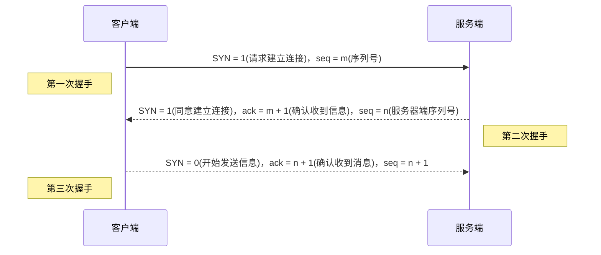
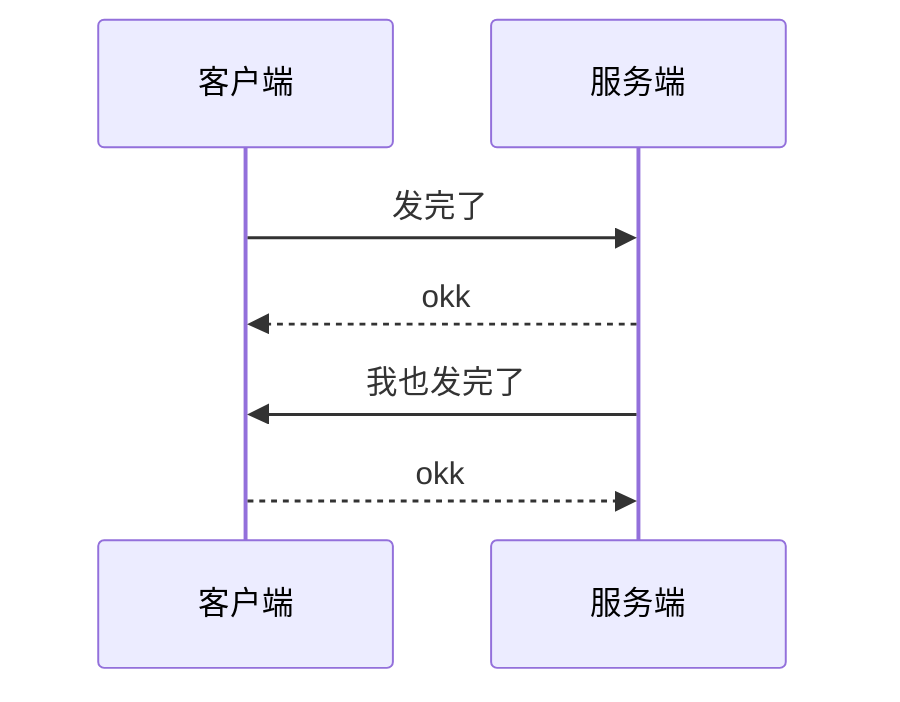
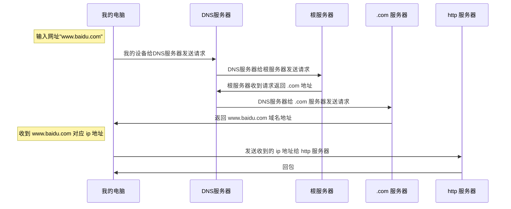

- [从输入URL到页面加载发生了什么](#从输入url到页面加载发生了什么)
  - [三次握手](#三次握手)
  - [四次挥手](#四次挥手)
  - [DNS解析](#dns解析)
  - [DNS常用算法](#dns常用算法)
  - [长连接和短连接](#长连接和短连接)
  - [TCP如何保证可靠](#tcp如何保证可靠)
    - [1. 校验和](#1-校验和)
    - [2. 确认应答与序列号](#2-确认应答与序列号)
    - [3. 超时重传](#3-超时重传)
    - [4. 连接管理](#4-连接管理)
    - [5. 流量控制](#5-流量控制)
      - [5.1. 最大消息长度](#51-最大消息长度)
      - [5.2. 滑动窗口控制](#52-滑动窗口控制)
    - [6. 拥塞控制](#6-拥塞控制)
      - [6.1. 慢启动](#61-慢启动)
      - [6.2. 拥塞避免](#62-拥塞避免)
      - [6.3. 快重传](#63-快重传)
      - [6.4. 快恢复](#64-快恢复)
  
# 从输入URL到页面加载发生了什么
```
    1> DNS解析（网址->IP地址）：DNS缓存：浏览器，操作系统，分级查询：本地DNS服务器，根域名服务器，COM顶级域名服务器，google.com域名服务器
    2> TCP连接（三次握手）
    3> 发送HTTP请求
    4> 服务端处理请求，返回HTTP报文
    5> 浏览器解析和渲染页面
    6> 连接结束（四次挥手）
```

## 三次握手



## 四次挥手


## DNS解析

>在互联网上，唯一标识一台计算机的是 IP地址


## DNS常用算法
>**主机向本地域名服务器的查询一般都是采用递归查询**
如果主机所询问的本地域名服务器不知道被查询域名的IP地址，那么本地域名 服务器就以DNS客户的身份，向其他根域名服务器继续发出查询请求报文，而不是让该主机自己进行下一步的查询。因此，递归查询返回的查询结果或是所要查询的IP地址，或是报错。

>**本地域名服务器向根服务器的查询通常采用迭代查询**
当根域名服务器收到本地域名服务器发出的迭代查询请求报文时，要么给出所要查询的IP地址，要么告诉本地域名服务器“下一次应向那个域名服务器进行查询”。然后让本地域名服务器进行后续的查询。根域名服务器通常把自己知道的顶级域名服务器的IP地址告诉本地域名服务器，让本地域名服务器再向顶级域名服务器查询。顶级域名服务器在收到本地域名服务器的查询请求后，要么给出所要查询的IP地址，要么告诉本地域名服务器下一步应当向哪一个权限域名服务器进行查询。本地域名服务器就这样进行迭代查询。

## 长连接和短连接
>**长连接和短连接的区别**:
1、长连接是client方与server方先建立连接，连接建立后不断开，而短连接的Client方与server每进行一次报文收发交易时才进行通讯连接；
2、短连接多用于操作频繁，点对点的通讯，而且长连接数不能太多的情况。

## TCP如何保证可靠
### 1. 校验和
>TCP检验和的计算与UDP一样，在计算时要加上12byte的伪首部，检验范围包括TCP首部及数据部分，但是UDP的检验和字段为可选的，而TCP中是必须有的。计算方法为：在发送方将整个报文段分为多个16位的段，然后将所有段进行反码相加，将结果存放在检验和字段中，接收方用相同的方法进行计算，如最终结果为检验字段所有位是全1则正确（UDP中也是全为1则正确），否则存在错误。


### 2. 确认应答与序列号
>TCP将每个字节的数据都进行了编号，这就是序列号。
序列号的作用：
a、保证可靠性（当接收到的数据总少了某个序号的数据时，能马上知道）
b、保证数据的按序到达
c、提高效率，可实现多次发送，一次确认
d、去除重复数据
数据传输过程中的确认应答处理、重发控制以及重复控制等功能都可以通过序列号来实现


>上述过程中，只要发送端有一个包传输，接收端没有回应确认包（ACK包），都会重发。或者接收端的应答包，发送端没有收到也会重发数据。这就可以保证数据的完整性

### 3. 超时重传
>超时重传是指发送出去的数据包到接收到确认包之间的时间，如果超过了这个时间会被认为是丢包了，需要重传。那么我们该如何确认这个时间值呢？

>我们知道，一来一回的时间总是差不多的，都会有一个类似于平均值的概念。比如发送一个包到接收端收到这个包一共是0.5s，然后接收端回发一个确认包给发送端也要0.5s，这样的两个时间就是RTT（往返时间）。然后可能由于网络原因的问题，时间会有偏差，称为抖动（方差）。

>从上面的介绍来看，超时重传的时间大概是比往返时间+抖动值还要稍大的时间。


### 4. 连接管理
>连接管理机制即TCP建立连接时的三次握手和断开连接时的四次挥手。

### 5. 流量控制
#### 5.1. 最大消息长度
>在建立TCP连接的时候，双方约定一个最大的长度（MSS）作为发送的单位，重传的时候也是以这个单位来进行重传。理想的情况下是该长度的数据刚好不被网络层分块。


#### 5.2. 滑动窗口控制
>我们上面提到的超时重传的机制存在效率低下的问题，发送一个包到发送下一个包要经过一段时间才可以。所以我们就想着能不能不用等待确认包就发送下一个数据包呢？这就提出了一个滑动窗口的概念。


>窗口的大小就是在无需等待确认包的情况下，发送端还能发送的最大数据量。这个机制的实现就是使用了大量的缓冲区，通过对多个段进行确认应答的功能。通过下一次的确认包可以判断接收端是否已经接收到了数据，如果已经接收了就从缓冲区里面删除数据。

>在窗口之外的数据就是还未发送的和对端已经收到的数据。那么发送端是怎么样判断接收端有没有接收到数据呢？或者怎么知道需要重发的数据有哪些呢？通过下面这个图就知道了。


>如上图，接收端在没有收到自己所期望的序列号数据之前，会对之前的数据进行重复确认。发送端在收到某个应答包之后，又连续3次收到同样的应答包，则数据已经丢失了，需要重发。

### 6. 拥塞控制
>流量控制解决了两台主机之间因传送速率而可能引起的丢包问题，在一方面保证了TCP数据传送的可靠性。然而如果网络非常拥堵，此时再发送数据就会加重网络负担，那么发送的数据段很可能超过了最大生存时间也没有到达接收方，就会产生丢包问题。
为此TCP引入慢启动机制，先发出少量数据，就像探路一样，先摸清当前的网络拥堵状态后，再决定按照多大的速度传送数据。
此处引入一个拥塞窗口：
发送开始时定义拥塞窗口大小为1；每次收到一个ACK应答，拥塞窗口加1；而在每次发送数据时，发送窗口取拥塞窗口与接送段接收窗口最小者。

>慢启动：在启动初期以指数增长方式增长；设置一个慢启动的阈值，当以指数增长达到阈值时就停止指数增长，按照线性增长方式增加；线性增长达到网络拥塞时立即“乘法减小”，拥塞窗口置回1，进行新一轮的“慢启动”，同时新一轮的阈值变为原来的一半。
“慢启动”机制可用图表示：

#### 6.1. 慢启动
>1）连接建好的开始先初始化cwnd = 1，表明可以传一个MSS大小的数据。
2）每当收到一个ACK，cwnd++; 呈线性上升
3）每当过了一个RTT，cwnd = cwnd*2; 呈指数让升
4）还有一个ssthresh（slow start threshold），是一个上限，当cwnd >= ssthresh时，就会进入“拥塞避免算法”（后面会说这个算法）
#### 6.2. 拥塞避免
>1）收到一个ACK时，cwnd = cwnd + 1/cwnd
2）当每过一个RTT时，cwnd = cwnd + 1
这样就可以避免增长过快导致网络拥塞，慢慢的增加调整到网络的最佳值。很明显，是一个线性上升的算法。
#### 6.3. 快重传
>当出现ack超时的时候，需要重传数据包。
sshthresh = cwnd /2
cwnd 重置为 1
进入慢启动过程
TCP认为这种情况太糟糕，反应也很强烈。
快速重传在收到3个duplicate ACK时就开启重传(三次 ack 就认为丢包的原理见关于TCP乱序和重传的问题、TCP 快速重传为什么是三次冗余 ACK)，而不用等到RTO超时。

>TCP Reno的实现是：
cwnd = cwnd /2
sshthresh = cwnd
进入快速恢复算法——Fast Recovery
#### 6.4. 快恢复
